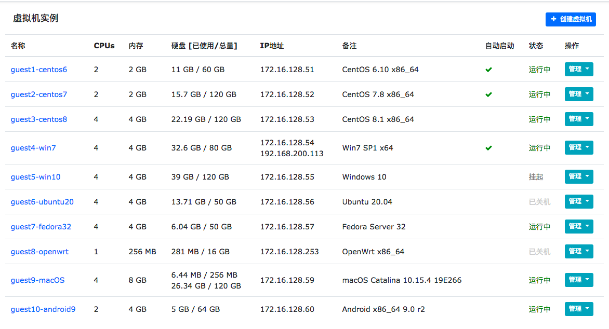

Kvm Man
=========

Kvman = Kvm Man = Kernel-based Virtual Machine Manager

Version: v1.0.0-Beta





## Dependency Components

### Based environments

* CentOS 7.7 x86_64

* Python 2.7.xx


### Install Kvm requirements

```
yum update -y
yum install -y centos-release-qemu-ev
yum install -y qemu-kvm-ev qemu-kvm-common-ev qemu-img-ev qemu-kvm-tools-ev libvirt libvirt-python virt-install
```


### Python requirements

- [Python](http://www.python.org)：2.7.x

- [Torweb](https://github.com/xkstudio/Torweb)：1.0+

- [Tornado](http://www.tornadoweb.org/)：5.0+

- [Jinja2](http://jinja.pocoo.org/)：2.9+

- [Redis-Py](https://github.com/andymccurdy/redis-py)：2.10+

- [Libvirt](https://github.com/libvirt/libvirt-python): 2.0+

- [Supervisor](https://pypi.org/project/setuptools): 3.0+

- [noVNC](https://github.com/novnc/noVNC)

- [websockify](https://github.com/novnc/websockify)

- simplejson

- numpy v**1.16.6**

> pip install tornado==5.1.1 supervisor==3.3.5 numpy==1.16.6 simplejson Jinja2 redis


## Deploy Redis Server

See https://redis.io/


## Configure for Kvman

Change configurations for **redis** via [settings.py](config/settings.py), such as `host` `port` `password`


## Run Kvman

### Install

> python run.py --install=1

### Run Kvman

> python run.py [--port=8080]

### Run Console Server

> python vendor/console.py --token-plugin console.Token 6080


## Configure for Supervisor

```
[program:kvman]
command=/usr/bin/python2.7 run.py --port=8080 2>&1 >> /tmp/kvman.log
autorestart=true
autostart=true
directory=/var/www/kvman
redirect_stderr=true
stdout_logfile=/tmp/kvman.log

[program:kvman_console]
command=/usr/bin/python2.7 vendor/console.py --token-plugin console.Token 6080
autorestart=true
autostart=true
directory=/var/www/kvman
redirect_stderr=true
stdout_logfile=/tmp/kvman_console.log
```


## Related Links

- [QEMU](https://www.qemu.org/download/)

- [Libvirt](http://libvirt.org/sources/)

- [VirtIO for Windows](https://docs.fedoraproject.org/en-US/quick-docs/creating-windows-virtual-machines-using-virtio-drivers/index.html)

- [Qemu-Guest-Agent](https://wiki.qemu.org/Features/GuestAgent)

- [OSX-KVM](https://github.com/kholia/OSX-KVM)

- [Linux-Kvm](https://www.linux-kvm.org/)


## License

This project is under the GPLv3 License. See the [LICENSE](LICENSE) file for the full license text.
