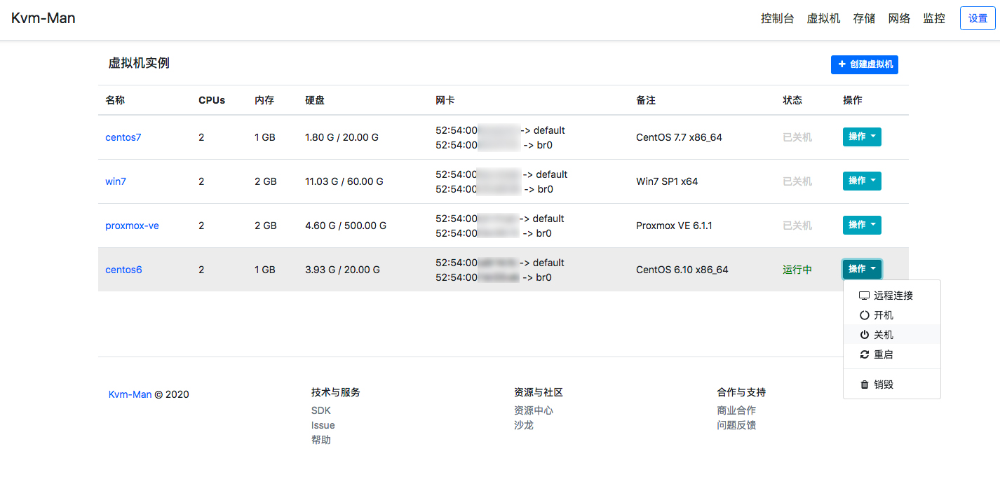

Kvm Man
=========

Kvman = Kvm Man = Kernel-based Virtual Machine Manager

## Version

**v1.0.0-Beta**

## Dependency Components

- [Python](http://www.python.org)：2.7.x

- [Torweb](https://github.com/xkstudio/Torweb)：1.0+

- [Tornado](http://www.tornadoweb.org/)：5.0+

- [Jinja2](http://jinja.pocoo.org/)：2.9+

- [Redis-Py](https://github.com/andymccurdy/redis-py)：2.10+

- [Libvirt](https://github.com/libvirt/libvirt-python): 2.0+

> pip install tornado==5.1.1 Jinja2 redis
